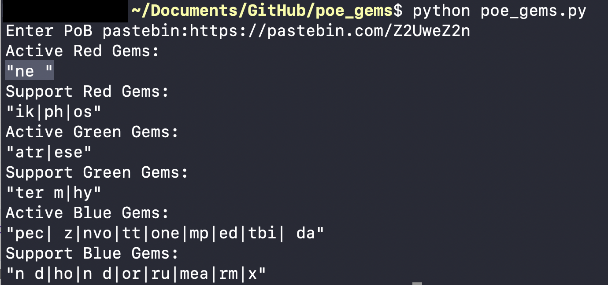

<!-- Title -->
<br />
<p align="center">
  <h2 align="center">Path of Exile Gem Regex Generator</h2>

  <p align="center">
    project_description
    <br />
    <a href="https://github.com/bentrenguyen/poe_gems"><strong>Explore the docs »</strong></a>
  </p>
</p>


<!-- TABLE OF CONTENTS -->
<details open="open">
  <summary><h2 style="display: inline-block">Table of Contents</h2></summary>
  <ol>
    <li>
      <a href="#about-the-project">About The Project</a>
      <ul>
        <li><a href="#built-with">Built With</a></li>
      </ul>
    </li>
    <li>
      <a href="#getting-started">Getting Started</a>
      <ul>
        <li><a href="#prerequisites">Prerequisites</a></li>
      </ul>
    </li>
    <li><a href="#usage">Usage</a></li>
    <li><a href="#acknowledgements">Acknowledgements</a></li>
  </ol>
</details>


<!-- ABOUT THE PROJECT -->
## About The Project
A Path of Exile tool to more easily locate and buy skill gems from Lilly. 


### Built With

* [python](https://www.python.org/)
* [pandas](https://pandas.pydata.org/)
* [pobapi](https://github.com/ppoelzl/PathOfBuildingAPI)


<!-- GETTING STARTED -->
## Getting Started

To get a local copy up and running follow these simple steps.

### Prerequisites

This is an example of how to list things you need to use the software and how to install them.
* pip
  ```sh
  pip install pandas
  pip install pobapi
  ```

<!-- USAGE EXAMPLES -->
## Usage

Run poe_gems.py and enter in your Path of Building pastebin. You will be returned a series of strings to copy/paste into the vendor window, separated by tab (Active Strength Gems, Support Dex Gems, etc.)



<!-- ACKNOWLEDGEMENTS -->
## Acknowledgements

* [pobapi](https://github.com/ppoelzl/PathOfBuildingAPI)